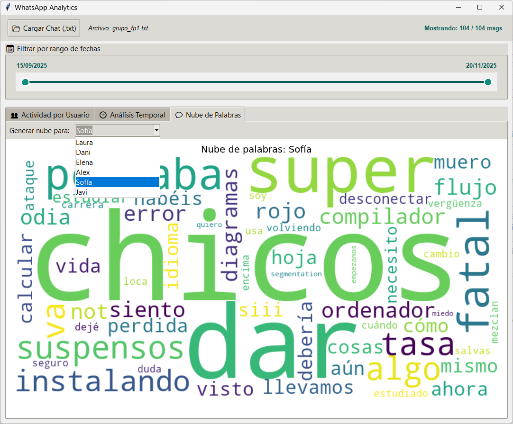

# 🔎 Proyecto de Laboratorio: WhatsApp Analytics
## Fundamentos de Programación 1. Grado en Ingeniería Informática – Inteligencia Artificial (Universidad de Sevilla)

WhatsApp es la herramienta de comunicación más utilizada del mundo, pero ¿alguna vez te has preguntado qué patrones esconden tus conversaciones? ¿Quién escribe más? ¿A qué hora sois más activos? ¿Qué palabras definen a cada participante?

En este laboratorio construiremos **WhatsApp Analytics**, una herramienta capaz de leer los historiales de chat exportados desde la aplicación y extraer información interesante. 

Disponemos de una interfaz gráfica ya implementada para visualizar la información extraída:



* **Cargar Chat:** Permite abrir un fichero `.txt` exportado de WhatsApp (Android o iOS).
* **Filtro por rango de fechas:** Un deslizador doble para seleccionar el rango de fechas a analizar.
* **Actividad por Usuario:** Muestra gráficos de tarta (volumen de mensajes por usuario) y barras (longitud media de mensajes por usuario).
* **Análisis Temporal:** Gráficos de actividad por horas del día y días de la semana.
* **Nube de Palabras:** Visualización de los términos más característicos de cada usuario.

Sin embargo, **para que estas visualizaciones funcionen, es necesario implementar la lógica de análisis de datos**. Esta será tu tarea.

---

## Preparación del entorno

👉 Para configurar Git y clonar el repositorio del laboratorio, consulta **[instrucciones_git.md](https://github.com/FP1-25-26/instrucciones_git.md)**.

**Para poder ejecutar la interfaz gráfica y visualizar las nubes de palabras, es necesario instalar `wordcloud`**. Ejecuta el siguiente comando desde el terminal:

```
pip install wordcloud
```

---

## ⏱ Duración estimada

2 horas

---

## ✅ ¿Qué se practica?

* Tratamiento de listas de objetos (`list`).
* Manejo de fechas y horas (`datetime.date`, `datetime.time`).
* Uso de diccionarios y contadores (`dict`, `Counter`, `defaultdict`).
* Lógica de filtrado y agregación de datos.
* Procesamiento básico de cadenas de texto (`str`).

---

## 📁 Archivos del proyecto

Dispones de estos archivos en `src`:

| Archivo | Qué hace |
| :--- | :--- |
| `whatsapp_gui.py` | Interfaz de usuario (ya implementada). |
| `whatsapp_loader.py` | Módulo encargado de leer el fichero de texto y convertirlo en objetos (ya implementado). |
| `whatsapp_utiles.py` | **Funciones de análisis a implementar por el estudiante.** |
| `whatsapp_utiles_test.py` | Pruebas de las funciones del módulo `whatsapp_utiles.py`. |

También disponemos de un archivo `data/grupo_fp1.txt` que contiene el log de conversaciones de un grupo ficticio de alumnos de nuestra asignatura. Puedes usar este archivo para las pruebas, pero es más divertido si cargas uno real de alguno de tus grupos de Whatsapp una vez hayas completado los ejercicios. Si no sabes exportar tus conversaciones, mira este enlace: https://faq.whatsapp.com/1180414079177245/?cms_platform=android&locale=es_LA (sólo es necesario exportar los mensajes, no incluyas los archivos en la exportación).

---

### Representación de los datos

En todos los ejercicios trabajaremos con una lista de tuplas de tipo `Mensaje`. Utilizaremos la siguiente definición de `namedtuple`:

```python
Mensaje = namedtuple('Mensaje', ['fecha', 'hora', 'usuario', 'texto'])
```

Los campos `fecha` y `hora` son de tipo `datetime.date` y `datetime.time`, respectivamente. Los campos `usuario` y `texto` son de tipo `str`.


### Lectura de los mensajes desde el archivo de log

La lectura del archivo de log ya está implementada en la función `leer_log_whatsapp` del módulo `whatsapp_loader.py`. La aplicación usará esta función para obtener una lista de tuplas de tipo `Mensaje`. Las funciones que tienes que implementar recibirán esta lista de tuplas. **Ten en cuenta que los mensajes aparecen ordenados cronológicamente en la lista recibida**.

Prueba cada una de las funciones que vayas implementando, ejecutando las pruebas del módulo `whatsapp_utiles_test.py`.

## 📌 Ejercicio 1: Función `calcula_rango_fechas`

Implementa la función `calcula_rango_fechas` que recibe una lista de mensajes y devuelve una tupla con dos fechas: la del **primer mensaje** y la del **último mensaje**.

Ten en cuenta que:
* La lista de mensajes que recibe la función ya viene ordenada cronológicamente.
* Si la lista está vacía, la función debe devolver `None`.

## 📌 Ejercicio 2: Función `filtra_mensajes_por_fechas`

Implementa la función `filtra_mensajes_por_fechas`. Esta función recibe la lista original de mensajes y dos fechas opcionales: `fecha_inicio` y `fecha_fin`. Debe devolver una **nueva lista** que contenga solo los mensajes cuya fecha esté comprendida en ese intervalo (ambos inclusive).

Ten en cuenta que:
* Si `fecha_inicio` es `None`, no hay límite inferior (se incluyen mensajes desde el principio).
* Si `fecha_fin` es `None`, no hay límite superior (se incluyen mensajes hasta el final).

**¿Cómo utiliza esta función nuestra aplicación?** Cada vez que mueves el deslizador de rango en la interfaz, se llama a esta función para recalcular qué mensajes se muestran en las gráficas. Por tanto, la lista de mensajes que recibirán el resto de funciones será el resultado de realizar este filtrado (y no la lista completa de mensajes leídos anteriormente). De esta forma, la información mostrada por la aplicación corresponderá al rango de fechas seleccionado.

## 📌 Ejercicio 3: Conteo de mensajes

Vamos a implementar tres funciones muy parecidas. En todas ellas, debes **contar cuántos mensajes hay en la lista correspondientes a una determinada propiedad**: mensajes por usuario, mensajes por hora y mensajes por día de la semana. 

**Se recomienda utilizar el tipo `Counter` para las siguientes funciones**.

### Función `cuenta_mensajes_por_usuario`

Implementa la función `cuenta_mensajes_por_usuario` que recibe la lista de mensajes y devuelve un diccionario de recuentos, donde las claves son los nombres de los **usuarios** y los valores son el **número total de mensajes** que ha enviado cada uno.

### Función `cuenta_mensajes_por_hora`

Implementa la función `cuenta_mensajes_por_hora`. Esta función debe analizar la hora de envío de cada mensaje y devolver un diccionario de recuentos donde las claves son enteros que representan la **hora del día** (de 0 a 23), y los valores son la cantidad de mensajes enviados en esa hora.

### Función `cuenta_mensajes_por_dia_semana`

Implementa la función `cuenta_mensajes_por_dia_semana`. Queremos saber qué día de la semana es más activo. La función debe devolver un diccionario de recuentos de mensajes por día:

* Las claves deben ser los nombres de los días: "Lunes", "Martes", etc.
* Utiliza la lista constante `DIAS_SEMANA` proporcionada (puedes ver su definición al comienzo del módulo `whatsapp_utiles.py`) para traducir el índice numérico del día de la semana al nombre correspondiente.


## 📌 Ejercicio 4: Función `calcula_longitud_media_por_usuario`

Implementa la función `calcula_longitud_media_por_usuario`. A diferencia del ejercicio 3.1 (que contaba cantidad), aquí queremos saber quién escribe mensajes más largos ("mucho texto") o más cortos ("ok").

Algoritmo sugerido:
1.  Agrupa las longitudes de los textos de cada mensaje por usuario (puedes usar un `defaultdict(list)`).
2.  Recorre esa agrupación y calcula la media aritmética de las longitudes para cada usuario.
3.  Devuelve un diccionario `usuario -> media`.


## 📌 Ejercicio 5: Función `detecta_dia_mas_activo`

Implementa la función `detecta_dia_mas_activo` que recibe la lista de mensajes y devuelve una tupla `(fecha, numero_mensajes)` correspondiente al día (fecha concreta, por ejemplo `datetime.date(2024, 1, 1)`) en el que se enviaron más mensajes en total.

Ten en cuenta que:
* Si la lista de mensajes está vacía, debe devolver `None`.
* Se recomienda utilizar `Counter`. Repasa los métodos del tipo vistos en el tema 5 de teoría.

## 📌 Ejercicio 6: Función `analiza_palabras_caracteristicas`

Implementa la función `analiza_palabras_caracteristicas`. Esta función genera los datos para construir una "nube de palabras" que visualizará las palabras más características de un usuario. No queremos simplemente las palabras más usadas, sino las palabras que **distinguen** a un usuario del resto.

La función recibe la lista de mensajes, un `usuario` objetivo y un número `n`. Debe devolver una lista de tuplas `(palabra, recuento)` con las `n` palabras más características y sus recuentos.

**Algoritmo de "frecuencia distintiva":**
1.  Inicializa un contador (usa `Counter`).
2.  Recorre todos los mensajes.
3.  Para cada mensaje:
    * Obtén las palabras normalizadas (pásalo a minúsculas y divide las palabras separadas por espacios del texto del mensaje).
    * Quédate solo con las palabras formadas por letras.
    * Si el mensaje **ES** del usuario objetivo: **suma** esas palabras al contador.
    * Si el mensaje **NO ES** del usuario objetivo: **resta** esas palabras al contador.
4.  Devuelve los `n` elementos más comunes del contador resultante.

**Repasa los métodos del tipo vistos en el tema 5 de teoría**, para recordar cómo sumar o restar las apariciones de los elementos de una secuencia a un `Counter`. 

**¿Cómo utiliza esta función nuestra aplicación?** En la pestaña "Nube de Palabras", al seleccionar un usuario, se mostrarán grandes aquellas palabras que ese usuario dice mucho y los demás dicen poco.

---

Una vez implementadas todas las funciones, puedes probar la aplicación ejecutando `whatsapp_gui.py` y cargando tu propio archivo de log.


